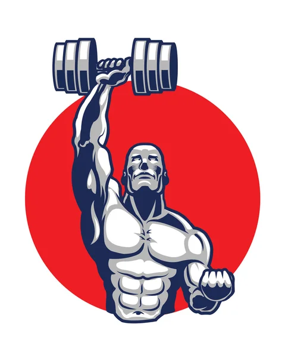

# Simple Gym System

<!-- PROJECT LOGO -->
<br />
<div align="center">
  <a href="#">
    
  </a>

  <h3 align="center">Larvel Gym System</h3>

  <p align="center">
    A Laravel PHP Web Application based on rules like Admin, City Manager, Gym Manager. All features are explained below.
  </p>
</div>

<!-- ABOUT THE PROJECT -->

## About The Project

### Built With

-   [Laravel](https://laravel.com/)
-   [Admin LTE](https://adminlte.io/)
-   [Laravel Cashier](https://github.com/laravel/cashier-stripe/)
-   [Laravel Sanctum](https://github.com/laravel/sanctum/)
-   [Laravel Ban](https://github.com/cybercog/laravel-ban/)
-   [Laravel Permissions](https://github.com/spatie/laravel-permission/)
-   [Laravel UI](https://github.com/laravel/ui)

<!-- ### ERD & Mapping


 -->

### Prerequisites

-   PHP
-   Composer

### Installation

1. Run this command to install dependencies
    ```sh
    composer update
    ```
2. Run this command to migrate the database and seed it with some data
    ```sh
    php artisan migrate:fresh --seed
    ```
3. Configure your `.env` file
4. Run this command to create an admin account
    ```sh
    php artisan create:admin
    ```
